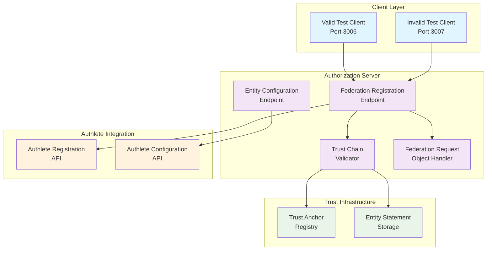

# Design Document: OpenID Federation Dynamic Registration

## Overview

This design extends our existing OAuth 2.0 authorization server with OpenID Federation 1.0 Dynamic Registration capabilities using Authlete's federation APIs. The system enables federated clients to register automatically through trust chain validation, eliminating the need for manual pre-registration while maintaining security through trust anchor verification.

The implementation leverages Authlete's `/api/federation/registration` endpoint for client registration and includes comprehensive trust chain validation, federation request object handling, and automated testing infrastructure with both valid and invalid client scenarios.

## Architecture

The federation dynamic registration system follows a layered architecture that integrates with our existing OAuth infrastructure:



## Components and Interfaces

### Federation Registration Endpoint

**Purpose**: Handles dynamic client registration requests from federated entities

**Interface**:
```typescript
interface FederationRegistrationEndpoint {
  // POST /federation/registration
  registerClient(request: FederationRegistrationRequest): Promise<FederationRegistrationResponse>
}

interface FederationRegistrationRequest {
  entityConfiguration?: string  // JWT entity configuration
  trustChain?: EntityStatement[] // Array of entity statements
  requestObject?: string        // Signed federation request object
}

interface FederationRegistrationResponse {
  clientId: string
  clientSecret?: string
  entityStatement: string       // JWT response from Authlete
  trustAnchorId: string
}
```

**Responsibilities**:
- Validate incoming registration requests
- Coordinate trust chain validation
- Handle federation request objects
- Call Authlete federation/registration API
- Return appropriate responses and errors

### Trust Chain Validator

**Purpose**: Validates federation trust chains against configured trust anchors

**Interface**:
```typescript
interface TrustChainValidator {
  validateTrustChain(entityId: string, trustChain?: EntityStatement[]): Promise<ValidationResult>
  resolveTrustChain(entityId: string): Promise<EntityStatement[]>
  extractClientMetadata(trustChain: EntityStatement[]): ClientMetadata
}

interface ValidationResult {
  isValid: boolean
  trustAnchor?: string
  clientMetadata?: ClientMetadata
  errors?: ValidationError[]
}

interface EntityStatement {
  jwt: string
  payload: {
    iss: string
    sub: string
    exp: number
    jwks?: JWKSet
    metadata?: EntityMetadata
    authorityHints?: string[]
  }
}
```

**Responsibilities**:
- Resolve trust chains from entity configurations
- Verify JWT signatures in entity statements
- Validate trust chain termination at trust anchors
- Extract and combine client metadata
- Apply metadata policies

### Federation Request Object Handler

**Purpose**: Processes signed federation request objects

**Interface**:
```typescript
interface FederationRequestObjectHandler {
  validateRequestObject(requestObject: string, clientJwks: JWKSet): Promise<RequestObjectValidation>
  extractRegistrationParameters(requestObject: string): RegistrationParameters
}

interface RequestObjectValidation {
  isValid: boolean
  payload?: any
  errors?: string[]
}
```

**Responsibilities**:
- Validate request object signatures
- Extract registration parameters from request objects
- Handle both signed and unsigned requests

### Authlete Integration Service

**Purpose**: Interfaces with Authlete federation APIs

**Interface**:
```typescript
interface AuthleteIntegrationService {
  registerFederatedClient(request: AuthleteFederationRegistrationRequest): Promise<AuthleteFederationRegistrationResponse>
  getEntityConfiguration(): Promise<string>
}

interface AuthleteFederationRegistrationRequest {
  entityConfiguration?: string
  trustChain?: string[]
}

interface AuthleteFederationRegistrationResponse {
  action: string
  responseContent: string
  client?: ClientInfo
}
```

**Responsibilities**:
- Call Authlete `/api/federation/registration` endpoint
- Handle Authlete API authentication
- Process Authlete responses and errors
- Manage API rate limiting and retries

## Data Models

### Entity Configuration
```typescript
interface EntityConfiguration {
  iss: string                    // Entity ID
  sub: string                    // Same as iss for self-signed
  exp: number                    // Expiration timestamp
  iat: number                    // Issued at timestamp
  jwks: JWKSet                   // Public keys
  metadata: {
    openid_relying_party?: ClientMetadata
    openid_provider?: ServerMetadata
    federation_entity?: FederationMetadata
  }
  authority_hints?: string[]     // Parent authorities
}
```

### Trust Chain
```typescript
interface TrustChain {
  entityId: string
  statements: EntityStatement[]
  trustAnchor: string
  expiresAt: number
  clientMetadata: ClientMetadata
}
```

### Test Client Configuration
```typescript
interface TestClientConfig {
  entityId: string
  port: number
  privateKey: string
  publicKey: JWK
  isValidInTrustAnchor: boolean
  metadata: ClientMetadata
}
```

## Correctness Properties

*A property is a characteristic or behavior that should hold true across all valid executions of a system-essentially, a formal statement about what the system should do. Properties serve as the bridge between human-readable specifications and machine-verifiable correctness guarantees.*

Now I need to analyze the acceptance criteria to determine which ones can be tested as properties.

Based on the prework analysis, I'll consolidate related properties to eliminate redundancy:

**Property 1: Trust Chain Validation Completeness**
*For any* entity ID and trust chain, when validating the trust chain, the validator should verify all entity statement signatures, confirm termination at a configured trust anchor, reject invalid or expired statements, and extract client metadata on success
**Validates: Requirements 2.1, 2.2, 2.3, 2.4, 2.5**

**Property 2: Registration Flow Consistency**  
*For any* successful trust chain validation, the registration service should call Authlete's federation/registration endpoint with the validated trust chain and client metadata, and return client credentials from Authlete's response
**Validates: Requirements 1.2, 3.1, 3.2, 3.3**

**Property 3: Error Propagation Completeness**
*For any* failed trust chain validation or Authlete API error, the system should reject the registration request with appropriate error codes and propagate error details to the client
**Validates: Requirements 1.3, 3.4, 6.1, 6.2, 6.3**

**Property 4: Federation Request Object Processing**
*For any* federation request object, the endpoint should validate the signature using the client's public key from the entity statement, extract registration parameters on success, and reject with invalid_request error on failure
**Validates: Requirements 5.1, 5.2, 5.3, 5.4**

**Property 5: Entity Configuration Validity**
*For any* entity configuration request, the authorization server should return a properly signed JWT containing federation metadata, public keys, supported features, and endpoints that validates against OpenID Federation 1.0 specification
**Validates: Requirements 7.2, 7.3, 7.4, 7.5**

**Property 6: Request Format Support**
*For any* registration request, the endpoint should accept both federation request objects and direct entity configurations/trust chains
**Validates: Requirements 1.5, 5.5**

**Property 7: Parameter Validation Completeness**
*For any* registration request, the authorization server should validate all required federation parameters and reject requests with missing or invalid parameters
**Validates: Requirements 6.4**

**Property 8: Rate Limiting Enforcement**
*For any* sequence of registration requests exceeding configured limits, the authorization server should implement rate limiting and reject excessive requests
**Validates: Requirements 6.5**

## Error Handling

The system implements comprehensive error handling across all federation operations:

### Trust Chain Validation Errors
- **Invalid Signature**: When entity statement signatures cannot be verified
- **Expired Statement**: When entity statements have passed their expiration time
- **Malformed Statement**: When entity statements don't conform to JWT structure
- **Unknown Trust Anchor**: When trust chains don't terminate at configured trust anchors
- **Missing Authority Hints**: When intermediate entities lack proper authority references

### Registration Errors
- **Invalid Client Metadata**: When extracted metadata fails validation
- **Authlete API Failure**: When Authlete registration calls fail
- **Missing Required Parameters**: When federation parameters are incomplete
- **Rate Limit Exceeded**: When registration requests exceed configured limits

### Request Object Errors
- **Invalid Signature**: When request object signatures cannot be verified
- **Missing Public Key**: When client public keys are not available for verification
- **Malformed Request Object**: When request objects don't conform to JWT structure

### Error Response Format
All errors follow RFC 6749 OAuth 2.0 error response format:
```json
{
  "error": "invalid_client_metadata",
  "error_description": "Trust chain validation failed: entity statement expired",
  "error_uri": "https://docs.example.com/federation-errors#expired-statement"
}
```

## Testing Strategy

The testing approach combines unit tests for specific scenarios with property-based tests for comprehensive validation:

### Unit Testing Focus
- **Specific Examples**: Valid and invalid test client scenarios (Requirements 4.3, 4.4)
- **Entity Configuration Endpoint**: Availability at /.well-known/openid_federation (Requirement 7.1)
- **Integration Points**: Authlete API integration with known test data
- **Edge Cases**: Malformed requests, expired tokens, missing parameters

### Property-Based Testing Focus
- **Trust Chain Validation**: Generate random entity configurations and trust chains to test validation logic comprehensively
- **Registration Flow**: Test registration behavior across various valid trust chain configurations
- **Error Handling**: Generate invalid inputs to verify error responses are consistent
- **Request Object Processing**: Test signed and unsigned request objects with various key configurations

### Test Configuration
- **Minimum 100 iterations** per property test to ensure comprehensive coverage
- **Test Tags**: Each property test references its design document property
- **Tag Format**: `Feature: federation-dynamic-registration, Property {number}: {property_text}`

### Test Infrastructure Requirements
- **Valid Test Client**: Entity ID registered in trust anchor, runs on port 3006
- **Invalid Test Client**: Entity ID not in trust anchor, runs on port 3007  
- **Trust Anchor Setup**: Configured with test client entity information
- **Authlete Configuration**: Service configured for federation support with unregistered client IDs

The dual testing approach ensures both specific scenarios work correctly (unit tests) and general behavior is sound across all possible inputs (property tests). Property tests handle the complexity of federation protocols while unit tests verify integration points and specific business requirements.