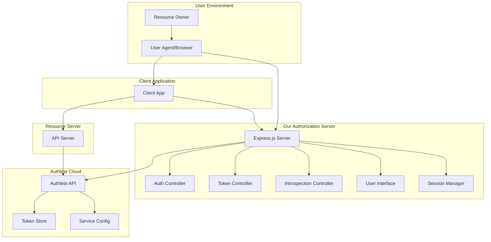

# Design Document: OAuth 2.0 Authorization Server with Authlete

## Overview

This document outlines the design for an OAuth 2.0 authorization server built using Node.js/TypeScript and Express.js, integrated with Authlete's cloud-based authorization service. The system implements the OAuth 2.0 authorization code flow as specified in RFC 6749, leveraging Authlete's APIs to handle protocol processing, token management, and validation.

The architecture follows a backend-for-frontend pattern where our Express server acts as the authorization server frontend, while Authlete handles the complex OAuth 2.0 protocol logic, token generation, and storage. This approach allows us to focus on user experience and business logic while ensuring standards compliance.

## Architecture

### High-Level Architecture



### Request Flow Architecture

The system handles three main OAuth 2.0 flows:

1. **Authorization Flow**: `/authorize` → User Authentication → Consent → Code Issuance
2. **Token Flow**: `/token` → Code Exchange → Access Token Issuance  
3. **Introspection Flow**: `/introspect` → Token Validation → Metadata Response

Each flow integrates with corresponding Authlete APIs for protocol processing while maintaining control over user experience and business logic.

## Components and Interfaces

### Core Components

#### 1. AuthleteClient
**Purpose**: HTTP client for Authlete API communication
**Responsibilities**:
- Manage API authentication using service access tokens
- Handle HTTP requests/responses with proper error handling
- Implement retry logic with exponential backoff
- Provide typed interfaces for all Authlete API endpoints

```typescript
interface AuthleteClient {
  authorization(request: AuthorizationRequest): Promise<AuthorizationResponse>
  authorizationIssue(request: AuthorizationIssueRequest): Promise<AuthorizationIssueResponse>
  authorizationFail(request: AuthorizationFailRequest): Promise<AuthorizationFailResponse>
  token(request: TokenRequest): Promise<TokenResponse>
  introspection(request: IntrospectionRequest): Promise<IntrospectionResponse>
}
```

#### 2. AuthorizationController
**Purpose**: Handle OAuth 2.0 authorization requests
**Responsibilities**:
- Process GET requests to `/authorize`
- Validate authorization parameters via Authlete
- Manage user authentication flow
- Handle consent collection
- Issue authorization codes

```typescript
interface AuthorizationController {
  handleAuthorizationRequest(req: Request, res: Response): Promise<void>
  authenticateUser(req: Request, res: Response): Promise<void>
  handleConsent(req: Request, res: Response): Promise<void>
  issueAuthorizationCode(ticket: string, subject: string): Promise<void>
}
```

#### 3. TokenController  
**Purpose**: Handle OAuth 2.0 token requests
**Responsibilities**:
- Process POST requests to `/token`
- Validate client authentication
- Exchange authorization codes for access tokens
- Return properly formatted token responses

```typescript
interface TokenController {
  handleTokenRequest(req: Request, res: Response): Promise<void>
  validateClientAuthentication(req: Request): Promise<ClientInfo>
}
```

#### 4. IntrospectionController
**Purpose**: Handle token introspection requests
**Responsibilities**:
- Process POST requests to `/introspect`
- Validate resource server authentication
- Return token metadata and validity status

```typescript
interface IntrospectionController {
  handleIntrospectionRequest(req: Request, res: Response): Promise<void>
  validateResourceServerAuth(req: Request): Promise<boolean>
}
```

#### 5. SessionManager
**Purpose**: Manage user authentication sessions
**Responsibilities**:
- Store and retrieve user authentication state
- Manage session lifecycle and expiration
- Associate sessions with authorization tickets

```typescript
interface SessionManager {
  createSession(userId: string, ticket: string): Promise<string>
  getSession(sessionId: string): Promise<SessionData | null>
  destroySession(sessionId: string): Promise<void>
  isAuthenticated(sessionId: string): Promise<boolean>
}
```

#### 6. UserInterface
**Purpose**: Render authentication and consent screens
**Responsibilities**:
- Display login forms
- Show consent screens with scope information
- Handle form submissions
- Provide error messaging

### External Interfaces

#### Authlete API Integration
The system integrates with five key Authlete API endpoints:

1. **POST /auth/authorization**: Validates authorization requests
2. **POST /auth/authorization/issue**: Issues authorization codes
3. **POST /auth/authorization/fail**: Handles authorization failures
4. **POST /auth/token**: Processes token requests
5. **POST /auth/introspection**: Validates access tokens

Each API call includes proper authentication headers and follows Authlete's request/response patterns as documented in their [OAuth 2.0 tutorial](https://www.authlete.com/developers/tutorial/oauth/).

## Data Models

### Request/Response Models

#### AuthorizationRequest
```typescript
interface AuthorizationRequest {
  parameters: string;  // URL-encoded query parameters
  clientId?: string;   // Optional for validation
}
```

#### AuthorizationResponse  
```typescript
interface AuthorizationResponse {
  action: 'INTERACTION' | 'NO_INTERACTION' | 'BAD_REQUEST' | 'UNAUTHORIZED' | 'FORBIDDEN' | 'INTERNAL_SERVER_ERROR';
  ticket: string;
  client: ClientInfo;
  service: ServiceInfo;
  scopes?: ScopeInfo[];
  responseContent?: string;
}
```

#### TokenRequest
```typescript
interface TokenRequest {
  parameters: string;  // URL-encoded form parameters
  clientId?: string;   // For client authentication
  clientSecret?: string;
}
```

#### TokenResponse
```typescript
interface TokenResponse {
  action: 'OK' | 'INVALID_CLIENT' | 'INVALID_REQUEST' | 'INVALID_GRANT' | 'INTERNAL_SERVER_ERROR';
  responseContent: string;  // JSON token response
  accessToken?: string;
  refreshToken?: string;
  accessTokenDuration?: number;
}
```

#### IntrospectionRequest
```typescript
interface IntrospectionRequest {
  token: string;
  scopes?: string[];
  subject?: string;
}
```

#### IntrospectionResponse
```typescript
interface IntrospectionResponse {
  action: 'OK' | 'BAD_REQUEST' | 'UNAUTHORIZED' | 'FORBIDDEN' | 'INTERNAL_SERVER_ERROR';
  responseContent?: string;
  active: boolean;
  clientId?: number;
  subject?: string;
  scopes?: string[];
  expiresAt?: number;
}
```

### Configuration Models

#### AuthleteConfig
```typescript
interface AuthleteConfig {
  baseUrl: string;           // e.g., 'https://us.authlete.com'
  serviceId: string;         // Service identifier
  serviceAccessToken: string; // API authentication token
  timeout: number;           // Request timeout in milliseconds
  retryAttempts: number;     // Number of retry attempts
}
```

#### SessionData
```typescript
interface SessionData {
  userId: string;
  ticket: string;
  authenticated: boolean;
  consentGiven: boolean;
  createdAt: Date;
  expiresAt: Date;
}
```

## Error Handling

### Error Categories

1. **Client Errors (4xx)**:
   - Invalid authorization parameters
   - Unauthorized client access
   - Invalid or expired authorization codes
   - Missing required parameters

2. **Server Errors (5xx)**:
   - Authlete API communication failures
   - Internal processing errors
   - Database/session store failures

3. **OAuth 2.0 Protocol Errors**:
   - `invalid_request`: Malformed or missing parameters
   - `unauthorized_client`: Client not authorized for requested grant type
   - `access_denied`: Resource owner denied authorization
   - `unsupported_response_type`: Unsupported response type
   - `invalid_scope`: Invalid or unknown scope
   - `server_error`: Internal server error
   - `temporarily_unavailable`: Service temporarily unavailable

### Error Handling Strategy

#### Authlete API Errors
```typescript
class AuthleteApiError extends Error {
  constructor(
    public statusCode: number,
    public authleteResponse: any,
    message: string
  ) {
    super(message);
  }
}

// Retry logic for transient failures
async function callAuthleteWithRetry<T>(
  apiCall: () => Promise<T>,
  maxRetries: number = 3
): Promise<T> {
  for (let attempt = 1; attempt <= maxRetries; attempt++) {
    try {
      return await apiCall();
    } catch (error) {
      if (attempt === maxRetries || !isRetryableError(error)) {
        throw error;
      }
      await delay(Math.pow(2, attempt) * 1000); // Exponential backoff
    }
  }
}
```

#### OAuth 2.0 Error Responses
The system returns OAuth 2.0 compliant error responses:

```typescript
interface OAuth2Error {
  error: string;           // Error code
  error_description?: string; // Human-readable description
  error_uri?: string;      // URI for additional information
  state?: string;          // State parameter if provided
}
```

## Testing Strategy

### Dual Testing Approach

The testing strategy employs both unit tests and property-based tests to ensure comprehensive coverage:

**Unit Tests**: Focus on specific examples, edge cases, and integration points
- Test specific OAuth 2.0 error scenarios
- Validate Authlete API integration with mock responses  
- Test user interface rendering and form handling
- Verify session management functionality

**Property-Based Tests**: Verify universal properties across all inputs
- Test that valid authorization requests always produce valid responses
- Verify token introspection consistency across different token types
- Ensure error responses always follow OAuth 2.0 specification format
- Validate that all user inputs are properly sanitized

### Property-Based Testing Configuration

- **Framework**: [fast-check](https://github.com/dubzzz/fast-check) for TypeScript
- **Minimum iterations**: 100 per property test
- **Test tagging**: Each property test references its design document property
- **Tag format**: `Feature: oauth2-authorization-server, Property {number}: {property_text}`

### Testing Framework Setup

```typescript
// Example property test structure
import fc from 'fast-check';

describe('OAuth 2.0 Authorization Server Properties', () => {
  it('Property 1: Valid authorization requests produce valid responses', () => {
    fc.assert(fc.property(
      validAuthorizationRequestArbitrary(),
      async (authRequest) => {
        const response = await authController.handleAuthorizationRequest(authRequest);
        expect(isValidOAuth2Response(response)).toBe(true);
      }
    ), { numRuns: 100 });
  });
});
```

## Correctness Properties

*A property is a characteristic or behavior that should hold true across all valid executions of a system—essentially, a formal statement about what the system should do. Properties serve as the bridge between human-readable specifications and machine-verifiable correctness guarantees.*

Based on the requirements analysis, the following correctness properties ensure the OAuth 2.0 authorization server operates according to specification:

### Property 1: Authorization Request Validation
*For any* authorization request, the system should validate it through Authlete API and return appropriate responses - valid requests proceed to authentication, invalid requests return OAuth 2.0 compliant errors with proper error codes (invalid_client, invalid_request, etc.)
**Validates: Requirements 1.1, 1.3, 1.4, 1.5**

### Property 2: Authentication Flow Consistency  
*For any* user accessing the authorization endpoint, unauthenticated users should see login forms, valid credentials should proceed to consent, and invalid credentials should show error messages with retry capability
**Validates: Requirements 2.1, 2.2, 2.3**

### Property 3: Consent Flow Handling
*For any* authenticated user, those without consent should see consent screens with requested scopes, granting consent should proceed to code issuance, and denying consent should redirect with access_denied error
**Validates: Requirements 2.4, 2.5, 2.6**

### Property 4: Authorization Code Issuance
*For any* successful authentication and consent, the system should call Authlete /auth/authorization/issue API, and successful generation should redirect to client with code parameter, preserving state parameter when provided
**Validates: Requirements 3.1, 3.2, 3.4**

### Property 5: Authorization Code Lifecycle
*For any* authorization code, it should be single-use and have appropriate expiration times as enforced by Authlete
**Validates: Requirements 3.5**

### Property 6: Token Request Processing
*For any* token request, valid requests with valid authorization codes should return properly formatted token responses (token_type, access_token, expires_in), while invalid codes, client authentication failures, or malformed parameters should return appropriate OAuth 2.0 errors (invalid_grant, invalid_client, invalid_request)
**Validates: Requirements 4.1, 4.2, 4.3, 4.4, 4.5**

### Property 7: Client Authentication Methods
*For any* client authentication, both client_secret_basic and client_secret_post methods should be supported and work correctly
**Validates: Requirements 4.6**

### Property 8: Token Introspection Consistency
*For any* introspection request, valid tokens should return metadata with active: true and proper scope/client/expiration information, invalid tokens should return active: false, and unauthenticated requests should return HTTP 401
**Validates: Requirements 5.1, 5.2, 5.3, 5.4**

### Property 9: Resource Server Authorization
*For any* introspection request, only authorized resource servers should be able to perform token introspection
**Validates: Requirements 5.5**

### Property 10: Error Handling and Recovery
*For any* Authlete API failure or network error, the system should log errors, return appropriate user-facing messages, and implement retry logic with exponential backoff for transient failures
**Validates: Requirements 6.1, 6.3**

### Property 11: Input Validation and Security
*For any* user input or request parameter, the system should validate and sanitize inputs to prevent injection attacks, reject malicious requests, and log security events
**Validates: Requirements 6.2, 6.4**

### Property 12: Rate Limiting Protection
*For any* sequence of requests to authorization and token endpoints, excessive requests should be properly rate limited to prevent abuse
**Validates: Requirements 6.5**

### Property 13: Configuration Loading
*For any* startup scenario, the system should properly read Authlete credentials from environment/config, support configurable base URLs, and fail with clear messages when credentials are missing/invalid
**Validates: Requirements 7.1, 7.2, 7.3**

### Property 14: HTTP Client Configuration
*For any* Authlete API call, the HTTP client should use proper timeouts, connection pooling, and session management configuration
**Validates: Requirements 7.4, 7.5**

### Property 15: Comprehensive Logging
*For any* authorization request, token issuance, authentication attempt, or error, the system should log appropriate information including client_id, scopes, outcomes, success/failure status, and detailed error information with stack traces
**Validates: Requirements 8.1, 8.2, 8.3, 8.4**

### Property 16: Health Check Availability
*For any* health check request, the system should provide proper monitoring endpoints that indicate system availability
**Validates: Requirements 8.5**

## Testing Strategy

### Dual Testing Approach

The testing strategy employs both unit tests and property-based tests to ensure comprehensive coverage:

**Unit Tests**: Focus on specific examples, edge cases, and integration points between components
- Test specific OAuth 2.0 error scenarios with known inputs
- Validate Authlete API integration with mock responses
- Test user interface rendering and form handling with specific data
- Verify session management functionality with concrete session data
- Test configuration loading with specific environment setups

**Property-Based Tests**: Verify universal properties across all inputs using randomized test data
- Generate random valid/invalid authorization requests to test validation consistency
- Create random user credentials to test authentication flow robustness  
- Generate random token requests to verify token processing correctness
- Test error handling with randomly generated failure scenarios
- Validate input sanitization with randomly generated malicious inputs

Both approaches are complementary and necessary for comprehensive coverage. Unit tests catch concrete bugs and verify specific integration points, while property tests verify general correctness across the entire input space.

### Property-Based Testing Configuration

**Framework**: [fast-check](https://github.com/dubzzz/fast-check) for TypeScript property-based testing
**Minimum iterations**: 100 per property test to ensure adequate randomization coverage
**Test tagging**: Each property test must reference its design document property using the format:
`Feature: oauth2-authorization-server, Property {number}: {property_text}`

**Example Property Test Structure**:
```typescript
import fc from 'fast-check';

describe('OAuth 2.0 Authorization Server Properties', () => {
  it('Feature: oauth2-authorization-server, Property 1: Authorization Request Validation', () => {
    fc.assert(fc.property(
      authorizationRequestArbitrary(),
      async (authRequest) => {
        const response = await authController.handleAuthorizationRequest(authRequest);
        if (isValidAuthRequest(authRequest)) {
          expect(response.action).toBe('INTERACTION');
        } else {
          expect(isOAuth2Error(response)).toBe(true);
        }
      }
    ), { numRuns: 100 });
  });
});
```

**Unit Testing Balance**: 
- Unit tests should focus on specific examples that demonstrate correct behavior
- Integration points between our Express server and Authlete APIs
- Edge cases and error conditions with known inputs
- Avoid writing too many unit tests since property-based tests handle comprehensive input coverage
- Property tests should focus on universal properties that hold for all inputs
- Comprehensive input coverage through randomization and generated test data

Each correctness property must be implemented by a single property-based test that validates the universal behavior across all valid inputs, ensuring the OAuth 2.0 authorization server operates correctly according to the specification.