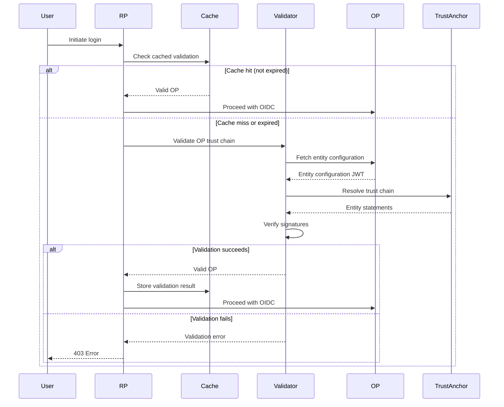

# Design Document: RP-Side OP Trust Chain Validation

## Overview

This design implements bidirectional trust validation in an OpenID Federation system. Currently, the Authorization Server (OP) validates that Relying Parties (RPs) are registered in the Trust Anchor. This feature adds the reciprocal validation: RPs validate that OPs are registered in the Trust Anchor before initiating authentication flows.

The implementation reuses existing trust chain validation components (`trustChainResolver`, `jwtSignatureVerifier`, `integratedTrustChainValidator`) and adds RP-specific validation logic, caching, and error handling. The Trust Anchor admin UI is enhanced to support managing both RP and OP entities with clear type differentiation.

## Architecture

### High-Level Flow

```
1. User initiates login on RP
2. RP validates OP trust chain:
   a. Fetch OP entity configuration
   b. Resolve trust chain to Trust Anchor
   c. Verify JWT signatures
   d. Check cache for previous validation
3. If validation succeeds:
   - Cache validation result
   - Proceed with OIDC discovery
   - Redirect user to OP
4. If validation fails:
   - Return 403 error
   - Display error message
   - Log failure details
```

### Component Interaction



## Components and Interfaces

### 1. OP Trust Chain Validator Service (New)

**Location**: `test-client-federation-valid/lib/opTrustChainValidator.js`

**Purpose**: Validates OP trust chains before authentication flows

**Interface**:
```javascript
class OPTrustChainValidator {
  constructor(config) {
    // config: { trustAnchorUrl, cacheExpirationMs }
  }

  /**
   * Validate OP trust chain
   * @param {string} opEntityId - OP's entity ID
   * @returns {Promise<ValidationResult>}
   */
  async validateOP(opEntityId) {
    // Returns: { isValid, trustAnchor, errors, cached }
  }

  /**
   * Check if OP is validated (from cache)
   * @param {string} opEntityId - OP's entity ID
   * @returns {boolean}
   */
  isOPValidated(opEntityId) {
    // Returns true if OP is in cache and not expired
  }

  /**
   * Clear validation cache
   */
  clearCache() {
    // Clears all cached validations
  }
}
```

**Dependencies**:
- Reuses `trustChainResolver` from TypeScript codebase
- Reuses `jwtSignatureVerifier` from TypeScript codebase
- Reuses `integratedTrustChainValidator` from TypeScript codebase

### 2. Validation Cache (New)

**Location**: In-memory cache within `OPTrustChainValidator`

**Structure**:
```javascript
{
  [opEntityId]: {
    isValid: boolean,
    trustAnchor: string,
    timestamp: number,
    expiresAt: number
  }
}
```

**Expiration**: 1 hour (3600000 ms)

**Behavior**:
- Cache is cleared on RP restart
- Expired entries are removed on access
- Periodic cleanup every 10 minutes

### 3. RP Authentication Middleware (Modified)

**Location**: `test-client-federation-valid/server.js`

**Changes**:
- Add OP validation before `/federation-login` redirect
- Check OP validation status in `/callback` handler
- Verify OP validation before token exchange

**New Middleware Function**:
```javascript
async function validateOPMiddleware(req, res, next) {
  const opEntityId = FEDERATION_CONFIG.authorizationServer;
  
  const result = await opValidator.validateOP(opEntityId);
  
  if (!result.isValid) {
    return res.status(403).render('error', {
      error: 'untrusted_op',
      error_description: `OP ${opEntityId} is not registered in Trust Anchor`,
      opEntityId: opEntityId,
      errors: result.errors
    });
  }
  
  req.opValidated = true;
  next();
}
```

### 4. Trust Anchor Entity Management (Modified)

**Location**: `trust-anchor/server.js`

**Changes**:
- Add `entityType` field to entity storage
- Modify entity statement creation to include entity type metadata
- Update admin API to support entity type specification

**Entity Storage Structure**:
```javascript
{
  entities: [
    {
      entityId: string,
      entityType: 'openid_relying_party' | 'openid_provider',
      addedAt: timestamp
    }
  ]
}
```

**Modified Entity Statement Payload**:
```javascript
{
  iss: trustAnchorId,
  sub: subordinateEntityId,
  iat: timestamp,
  exp: timestamp,
  jwks: { keys: [...] },
  metadata: {
    [entityType]: {
      // Entity-specific metadata
    }
  }
}
```

### 5. Trust Anchor Admin UI (Modified)

**Location**: `trust-anchor/views/admin.ejs`

**Changes**:
- Add entity type column to entity list table
- Add entity type selector to add entity form
- Display entity type badges (RP/OP) with distinct colors
- Filter entities by type

**UI Components**:
```html
<!-- Entity Type Selector -->
<select name="entityType" required>
  <option value="openid_relying_party">Relying Party (RP)</option>
  <option value="openid_provider">OpenID Provider (OP)</option>
</select>

<!-- Entity Type Badge -->
<span class="badge badge-rp">RP</span>
<span class="badge badge-op">OP</span>
```

## Data Models

### ValidationResult

```typescript
interface ValidationResult {
  isValid: boolean;
  trustAnchor?: string;
  errors?: ValidationError[];
  cached?: boolean;
  timestamp?: number;
}
```

### ValidationError

```typescript
interface ValidationError {
  code: string;
  message: string;
  details?: any;
}
```

### CacheEntry

```typescript
interface CacheEntry {
  isValid: boolean;
  trustAnchor?: string;
  timestamp: number;
  expiresAt: number;
}
```

### EntityRecord

```typescript
interface EntityRecord {
  entityId: string;
  entityType: 'openid_relying_party' | 'openid_provider';
  addedAt: number;
}
```

## Correctness Properties

*A property is a characteristic or behavior that should hold true across all valid executions of a system—essentially, a formal statement about what the system should do. Properties serve as the bridge between human-readable specifications and machine-verifiable correctness guarantees.*

### Property 1: OP Entity Configuration Fetching

*For any* OP entity ID, when the RP validates the OP, the RP should attempt to fetch the entity configuration from the correct federation discovery endpoint (`${opEntityId}/.well-known/openid-federation`)

**Validates: Requirements 1.1**

### Property 2: JWT Signature Verification

*For any* OP entity configuration with a valid signature, the RP should successfully verify the JWT signature using the OP's published keys

**Validates: Requirements 1.2**

### Property 3: Authority Hints Extraction

*For any* valid OP entity configuration, the RP should correctly extract the authority_hints array from the configuration payload

**Validates: Requirements 1.3**

### Property 4: Trust Chain Resolution

*For any* OP with authority_hints, the RP should recursively fetch entity statements from superior entities until reaching the Trust Anchor

**Validates: Requirements 1.4**

### Property 5: Trust Chain Termination Validation

*For any* resolved trust chain, the RP should verify that the chain terminates at the configured Trust Anchor

**Validates: Requirements 1.5**

### Property 6: Validation Before OIDC Discovery

*For any* authentication flow, trust chain validation should complete before OIDC discovery is initiated

**Validates: Requirements 2.1, 2.2**

### Property 7: Authentication Rejection for Invalid Chains

*For any* OP with an invalid trust chain, the RP should reject the authentication flow and return an error

**Validates: Requirements 2.3, 3.1**

### Property 8: Error Logging with Entity ID

*For any* trust chain validation failure, the RP should log the failure reason along with the OP's entity ID

**Validates: Requirements 2.4, 6.5**

### Property 9: Validation Result Caching

*For any* successful OP trust chain validation, the RP should cache the validation result with a timestamp

**Validates: Requirements 2.5, 7.1**

### Property 10: Cache Usage for Valid Entries

*For any* cached validation that is not expired, the RP should use the cached result instead of performing re-validation

**Validates: Requirements 7.2**

### Property 11: Cache Expiration and Re-validation

*For any* cached validation that is expired, the RP should perform a fresh validation and update the cache

**Validates: Requirements 7.3**

### Property 12: Error Response Structure

*For any* authentication rejection, the error response should include the OP's entity ID and specific failure reason

**Validates: Requirements 3.4, 6.5**

### Property 13: No Redirect for Untrusted OPs

*For any* untrusted OP, the RP should not redirect the user to the OP's authorization endpoint

**Validates: Requirements 3.5**

### Property 14: Entity Statement Type Consistency

*For any* entity registered in the Trust Anchor, the entity statement metadata type should match the registered entity type

**Validates: Requirements 5.1, 5.2, 5.5**

### Property 15: Entity Type Persistence

*For any* entity added to the Trust Anchor, the entity type should be persisted and returned in query results

**Validates: Requirements 5.3, 5.4**

### Property 16: Entity Statement Creation for OPs

*For any* OP entity added to the Trust Anchor, an entity statement should be created with openid_provider metadata type

**Validates: Requirements 4.4**

### Property 17: Entity Statement Revocation

*For any* OP entity removed from the Trust Anchor, the entity statement should no longer be served

**Validates: Requirements 4.5**

### Property 18: Trust Anchor Configuration Validation

*For any* RP startup, if the Trust Anchor URL is not configured, the RP should fail to start with a configuration error

**Validates: Requirements 9.2**

### Property 19: Trust Anchor URL Usage

*For any* OP validation, the RP should use the configured Trust Anchor URL as the root of trust

**Validates: Requirements 9.4**

### Property 20: Validation Before Token Exchange

*For any* token exchange request, the RP should only accept tokens from OPs that have been previously validated

**Validates: Requirements 10.3**

### Property 21: Callback Validation State Check

*For any* authentication callback, the RP should verify that the OP was previously validated before processing the callback

**Validates: Requirements 10.2**

## Error Handling

### Error Categories

1. **Network Errors**
   - OP entity configuration unreachable
   - Trust Anchor unreachable
   - Timeout errors
   - HTTP status: 503 Service Unavailable
   - Error code: `op_unreachable`

2. **Validation Errors**
   - Invalid JWT signature
   - Missing authority_hints
   - Trust chain doesn't reach Trust Anchor
   - Expired entity statements
   - HTTP status: 403 Forbidden
   - Error code: `trust_chain_invalid`

3. **Configuration Errors**
   - Missing Trust Anchor URL
   - Invalid Trust Anchor URL format
   - HTTP status: 500 Internal Server Error
   - Error code: `configuration_error`

4. **Cache Errors**
   - Cache corruption (non-fatal, triggers re-validation)
   - No HTTP response (internal only)

### Error Response Format

```json
{
  "error": "untrusted_op",
  "error_description": "OP https://op.example.com is not registered in Trust Anchor",
  "opEntityId": "https://op.example.com",
  "errors": [
    {
      "code": "trust_chain_invalid",
      "message": "Trust chain does not terminate at configured trust anchor",
      "details": {
        "expectedTrustAnchor": "https://trust-anchor.example.com",
        "actualTermination": "https://unknown-anchor.example.com"
      }
    }
  ]
}
```

### Error Logging

All validation failures should be logged with:
- Timestamp
- OP entity ID
- Error code
- Error message
- Stack trace (if applicable)
- Request context (session ID, user agent)

## Testing Strategy

### Unit Tests

Unit tests focus on specific examples, edge cases, and error conditions:

1. **OP Validator Tests**
   - Valid OP trust chain validation
   - Invalid signature rejection
   - Missing authority_hints handling
   - Network error handling
   - Cache hit/miss scenarios

2. **Cache Tests**
   - Cache entry creation
   - Cache expiration
   - Cache clearing
   - Expired entry removal

3. **Trust Anchor Tests**
   - Entity type storage
   - Entity statement creation with correct metadata type
   - Entity removal
   - Admin API endpoints

4. **Middleware Tests**
   - OP validation before redirect
   - Error response format
   - Callback validation state check

### Property-Based Tests

Property tests verify universal properties across all inputs (minimum 100 iterations per test):

1. **Trust Chain Resolution Property Tests**
   - Property 1: Entity configuration endpoint construction
   - Property 4: Recursive trust chain resolution
   - Property 5: Trust chain termination validation

2. **Caching Property Tests**
   - Property 9: Validation result caching
   - Property 10: Cache usage for valid entries
   - Property 11: Cache expiration and re-validation

3. **Error Handling Property Tests**
   - Property 7: Authentication rejection for invalid chains
   - Property 8: Error logging with entity ID
   - Property 12: Error response structure

4. **Entity Management Property Tests**
   - Property 14: Entity statement type consistency
   - Property 15: Entity type persistence
   - Property 16: Entity statement creation for OPs

### Integration Tests

1. **End-to-End Flow Tests**
   - Complete authentication flow with valid OP
   - Authentication rejection with untrusted OP
   - Cache behavior across multiple requests

2. **Trust Anchor Integration Tests**
   - Add OP entity via admin UI
   - Remove OP entity via admin UI
   - Fetch entity statement for OP

### Test Configuration

- Property tests: 100 iterations minimum
- Test timeout: 30 seconds per test
- Mock external HTTP calls in unit tests
- Use real HTTP calls in integration tests (with test Trust Anchor)

### Test Tags

All property tests must include tags referencing design properties:

```javascript
// Feature: rp-op-trust-validation, Property 9: Validation result caching
test('should cache successful OP validation results', async () => {
  // Test implementation
});
```

## Implementation Notes

### Reusing Existing Components

The implementation reuses the following TypeScript components from the OP-side validation:

1. **TrustChainResolver** (`src/federation/trustChainResolver.ts`)
   - Fetches entity configurations
   - Resolves trust chains
   - Validates chain structure

2. **JWTSignatureVerifier** (`src/federation/jwtSignatureVerifier.ts`)
   - Verifies JWT signatures
   - Validates JWT structure
   - Checks expiration

3. **IntegratedTrustChainValidator** (`src/federation/integratedTrustChainValidator.ts`)
   - Orchestrates complete validation
   - Combines resolution and verification
   - Extracts metadata

### JavaScript/TypeScript Interop

Since the RP is implemented in JavaScript (Node.js) and the validation components are in TypeScript, we have two options:

**Option 1: Compile TypeScript to JavaScript**
- Build TypeScript components to JavaScript
- Import compiled JavaScript in RP
- Simpler deployment

**Option 2: Use ts-node**
- Run TypeScript directly in Node.js
- Requires ts-node dependency
- Easier development

**Recommendation**: Use Option 1 for production, Option 2 for development

### Configuration

**RP Configuration** (`.env`):
```
TRUST_ANCHOR_URL=https://trust-anchor.example.com
OP_VALIDATION_CACHE_TTL=3600000
OP_VALIDATION_ENABLED=true
```

**Trust Anchor Configuration** (`.env`):
```
ENTITY_TYPE_SUPPORT=true
```

### Performance Considerations

1. **Caching**: 1-hour cache TTL reduces validation overhead
2. **Parallel Validation**: Multiple OPs can be validated concurrently
3. **Timeout**: 10-second timeout for entity configuration fetches
4. **Cache Cleanup**: Periodic cleanup every 10 minutes prevents memory leaks

### Security Considerations

1. **HTTPS Only**: All entity IDs must use HTTPS
2. **Signature Verification**: All JWTs must be verified
3. **Trust Anchor Pinning**: Trust Anchor URL is configured, not discovered
4. **Cache Poisoning**: Cache entries include validation timestamp
5. **Error Information**: Error messages don't leak sensitive information

## Migration Path

### Phase 1: Trust Anchor Enhancement
1. Add entity type field to entity storage
2. Update entity statement creation
3. Modify admin UI to support entity types
4. Test with existing RP entities

### Phase 2: RP Validation Implementation
1. Implement OPTrustChainValidator service
2. Add validation cache
3. Integrate with authentication flow
4. Test with registered OP

### Phase 3: Error Handling and Logging
1. Implement error response format
2. Add comprehensive logging
3. Create error UI templates
4. Test error scenarios

### Phase 4: Production Deployment
1. Deploy Trust Anchor changes
2. Register OP in Trust Anchor
3. Deploy RP changes
4. Monitor validation metrics

## Future Enhancements

1. **Multiple Trust Anchors**: Support multiple trust anchors for federation of federations
2. **Metadata Policies**: Apply metadata policies from intermediate authorities
3. **Automatic Registration**: Automatically register OPs discovered through federation
4. **Validation Metrics**: Track validation success/failure rates
5. **Admin Dashboard**: Enhanced admin UI with validation statistics
